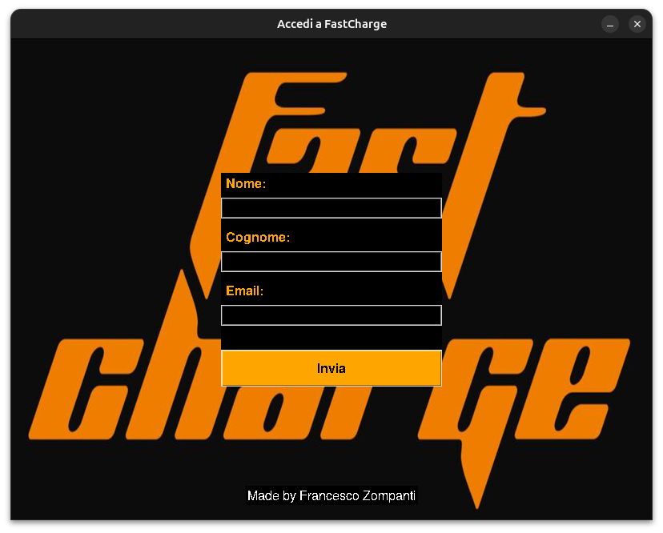

# FastCharge Login Dashboard
Send an email with a log of users who log into the system every 15 minutes, but only if the accessi.txt file contains data.

## Google Accounts Method
First, you have to create an app on your personal Google Account, and then create an .env file for storing the **EMAIL_APP_PASSWORD**, **SENDER_EMAIL** and **RECEIVER_EMAIL** env variable.

## Interface
