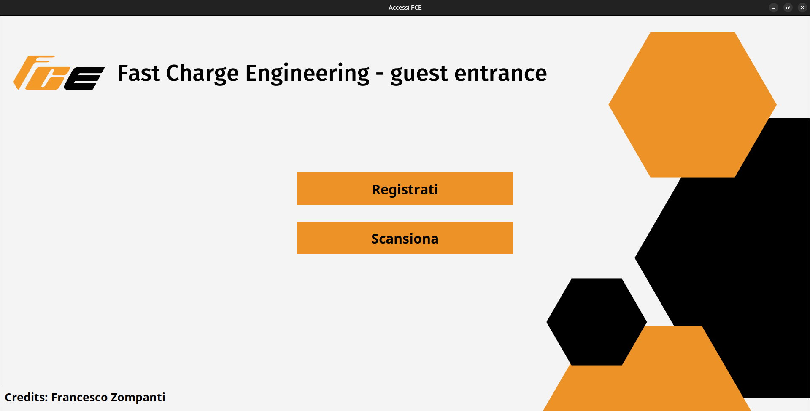
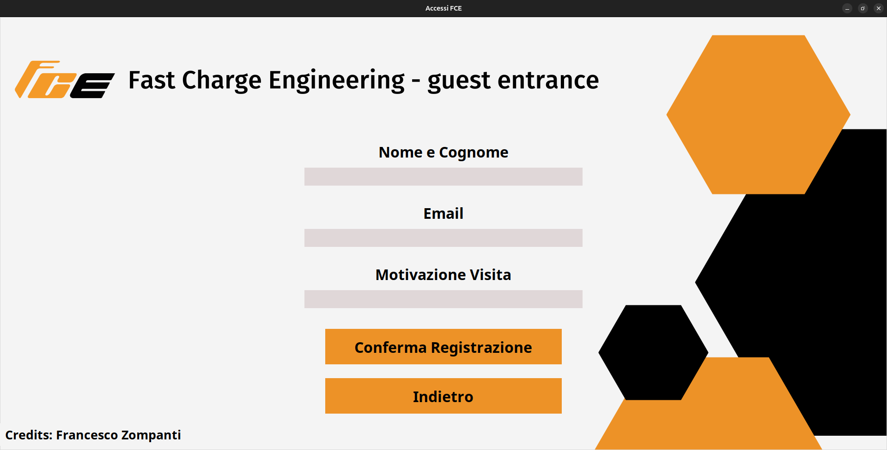

# FastCharge Login Interface
This Python script sends an email with users who log into the system every 15 minutes, but only if the accessi.txt file contains data.
In order to run the system, first install the requirements with **pip install -r requirements.txt** and the library for Linux with **sudo apt install libzbar0** and launch the system with **python3 main.py**

## Google Accounts Method
First, you have to create an app on your personal Google Account, and then create an .env file for storing the **EMAIL_APP_PASSWORD**, **SENDER_EMAIL** and **RECEIVER_EMAIL** variables.

## Aruba Accounts Method
Create a .env file with **SENDER_EMAIL**, **SENDER_PASSWORD**, **RECEIVER_EMAIL** variables and comment with **#** the Google Accounts method into **monitoraccessi.py** and uncomment Aruba method (they're defined in invia_email function)

## Interface

